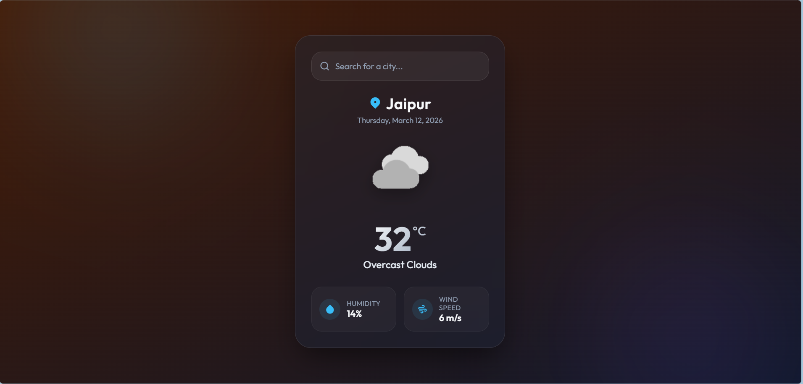

# 🌤️ Weather App Using JavaScript

A modern, responsive weather application built with vanilla JavaScript that provides real-time weather information for any city worldwide.


## 🚀 Features

- **Real-time Weather Data**: Get current weather information for any city
- **Search Functionality**: Easy-to-use search interface with city input
- **Comprehensive Weather Details**:
  - Current temperature in Celsius
  - Weather condition description
  - Humidity percentage
  - Wind speed in km/h
  - Current date display
- **Error Handling**: User-friendly error messages for invalid city names
- **Responsive Design**: Works seamlessly on desktop and mobile devices
- **Clean UI**: Modern interface with weather icons and intuitive layout

## 🛠️ Technologies Used

- **HTML5**: Semantic markup and structure
- **CSS3**: Modern styling with Flexbox/Grid layouts
- **Vanilla JavaScript**: ES6+ features for functionality
- **OpenWeatherMap API**: Real-time weather data
- **Material Design Icons**: Beautiful iconography
- **Remix Icon**: Additional icon library
- **Google Fonts**: Enhanced typography

## 📦 Installation

1. **Clone the repository**:
   ```bash
   git clone https://github.com/amandeveloper-2006/weather-app-using-js.git
   ```

2. **Navigate to the project directory**:
   ```bash
   cd weather-app-using-js
   ```

3. **Open the project**:
   - Simply open `index.html` in your preferred web browser
   - Or use a local server like Live Server in VS Code

## 🔧 Setup & Configuration

### API Key Setup

This app uses the OpenWeatherMap API. The API key is already included in the code, but you can get your own:

1. Visit [OpenWeatherMap](https://openweathermap.org/api)
2. Sign up for a free account
3. Get your API key
4. Replace the API key in `script.js`:

```javascript
const API_KEY = "your-api-key-here";
```
## Page Overview
-- It is a weather app that provides real-time weather information for any city worldwide. The app features a search functionality where users can enter a city name to retrieve current weather details such as temperature, weather condition, humidity, and wind speed. The interface is designed to be clean and modern, with responsive design for both desktop and mobile devices. The app also includes error handling for invalid city names and displays user-friendly messages when no data is found.




## 🚀 Usage

1. **Open the Weather App** in your browser
2. **Enter a city name** in the search input field
3. **Click the search button** or press Enter
4. **View the weather information** including:
   - City name and current date
   - Temperature
   - Weather condition
   - Humidity level
   - Wind speed

### Example Cities to Try:
- New York
- London
- Tokyo
- Mumbai
- Jaipur
- Paris

## 📱 Screenshots

*Weather app displaying current weather information with a clean, modern interface*

## 🎨 Project Structure

```
weather-app-using-js/
│
├── index.html          # Main HTML file
├── style.css           # CSS styles
├── script.js           # JavaScript functionality
├── README.md           # Project documentation
│
└── image/              # Weather-related images
    ├── clouds-3488632_1280.jpg
    ├── rain.jpg
    └── flat-cute-rain-cloud-illustration-symbol-with-unique-style-design-unusual-rainy-weather-forecast-template-vector.jpg
```

## 🔄 API Integration

The app integrates with the **OpenWeatherMap API** to fetch real-time weather data:

- **Endpoint**: `https://api.openweathermap.org/data/2.5/weather`
- **Parameters**: 
  - `q`: City name
  - `units`: metric (for Celsius)
  - `appid`: API key

### Sample API Response:
```json
{
  "name": "Jaipur",
  "main": {
    "temp": 30,
    "humidity": 50
  },
  "weather": [
    {
      "description": "scattered clouds"
    }
  ],
  "wind": {
    "speed": 3.5
  }
}
```

## ⚡ Key Features Implementation

### 🔍 Search Functionality
- Async/await for API calls
- Input validation
- Error handling for invalid cities

### 📊 Data Display
- Dynamic DOM manipulation
- Real-time date display
- Formatted temperature and weather data

### 🎨 User Interface
- Material Design icons
- Responsive layout
- Clean typography with Google Fonts

## 🚧 Future Enhancements

- [ ] 5-day weather forecast
- [ ] Geolocation-based weather
- [ ] Weather maps integration
- [ ] Dark/Light theme toggle
- [ ] Favorite cities list
- [ ] Weather alerts and notifications
- [ ] Historical weather data
- [ ] Multiple unit systems (Fahrenheit/Celsius)

## 🤝 Contributing

Contributions are welcome! Please feel free to submit a Pull Request. For major changes:

1. Fork the repository
2. Create your feature branch (`git checkout -b feature/AmazingFeature`)
3. Commit your changes (`git commit -m 'Add some AmazingFeature'`)
4. Push to the branch (`git push origin feature/AmazingFeature`)
5. Open a Pull Request

## 📄 License

This project is open source and available under the [MIT License](LICENSE).

## 👨‍💻 Author

**Aman Developer**
- GitHub: [@amandeveloper-2006](https://github.com/amandeveloper-2006)
- Project Link: [Weather App](https://github.com/amandeveloper-2006/weather-app-using-js)

## 🙏 Acknowledgments

- [OpenWeatherMap API](https://openweathermap.org/) for weather data
- [Material Design Icons](https://fonts.google.com/icons) for beautiful icons
- [Remix Icon](https://remixicon.com/) for additional iconography
- [Google Fonts](https://fonts.google.com/) for typography

---

⭐ **If you found this project helpful, please give it a star!** ⭐

*Built with ❤️ and JavaScript*
